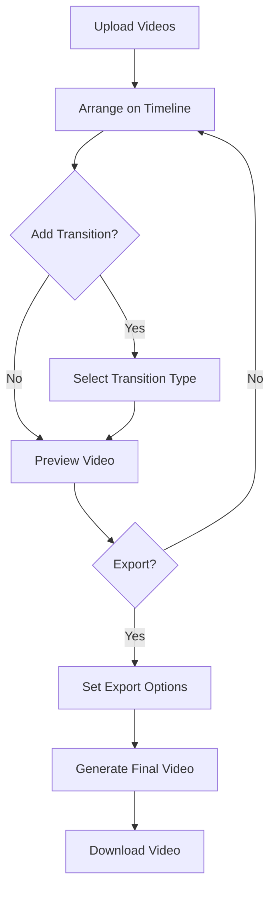
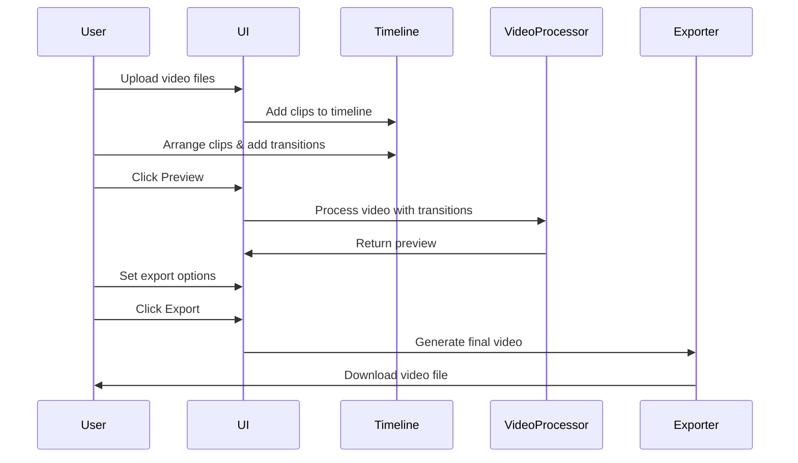

# 🎬 VideoSplicer

> A modern browser-based video editor for creating seamless transitions between clips

VideoSplicer allows you to edit videos directly in your browser with no installation required. Upload multiple video files, arrange them on an interactive timeline, add professional transitions, and export your final creation - all without leaving your browser.


## ✨ Features

- 📤 Upload multiple video files with drag-and-drop support
- 🎯 Arrange clips on an interactive timeline
- 🔄 Add professional transitions between clips (fade, wipe, dissolve, zoom, slide)
- 👁️ Real-time preview of your edits
- 💾 Export in various formats and quality settings
- 🖱️ Intuitive drag-and-drop interface
- ⌨️ Keyboard shortcuts for advanced users
- 📱 Responsive design (works best on desktop browsers)

## 📋 Table of Contents

- [Installation](#-installation)
- [Usage](#-usage)
- [Transition Types](#-transition-types)
- [Keyboard Shortcuts](#-keyboard-shortcuts)
- [Browser Compatibility](#-browser-compatibility)
- [Technical Details](#-technical-details)
- [Project Architecture](#-project-architecture)
- [Contributing](#-contributing)
- [License](#-license)

## 🚀 Installation

VideoSplicer runs completely in the browser with no server-side dependencies. To set up the project locally:

1. Clone the repository:
   ```bash
   git clone [https://github.com/username/videosplicer.git](https://github.com/Bros-AI/VideoSplicer)
   ```

2. Navigate to the project directory:
   ```bash
   cd videosplicer
   ```

3. Open `index.html` in your browser or set up a local server:
   ```bash
   # Using Python
   python -m http.server
   
   # Using Node.js and npx
   npx serve
   ```

## 🎮 Usage

1. **Upload Videos**: Drag and drop video files onto the upload area or click "Select Files"
2. **Arrange Clips**: Drag clips on the timeline to adjust timing
3. **Add Transitions**: Select a clip, click "Add Transition", and choose transition type
4. **Preview**: Click "Preview" to see your edited video
5. **Export**: Set quality and format options, then click "Export Video"

## 🔄 Transition Types

| Icon | Transition | Description | Options |
|------|------------|-------------|---------|
| ⊞ | Fade | Smooth crossfade between clips | Duration |
| ⬕ | Wipe | One clip wipes over another | Duration, Direction |
| ⊡ | Dissolve | Gradual pixel-based transition | Duration |
| ⊕ | Zoom | Zoom in/out between clips | Duration |
| ⇥ | Slide | One clip slides over another | Duration, Direction |

## ⌨️ Keyboard Shortcuts

| Key | Action |
|-----|--------|
| `Space` | Play/pause preview |
| `+` / `-` | Zoom in/out timeline |
| `Left Arrow` | Previous frame |
| `Right Arrow` | Next frame |
| `Home` | Go to start of timeline |
| `End` | Go to end of timeline |
| `Alt + S` | Toggle snap to grid |
| `Alt + Click & Drag` | Scroll timeline horizontally |

## 🌐 Browser Compatibility

| Browser | Supported | Recommended Version |
|---------|-----------|---------------------|
| Chrome | ✅ | 88+ |
| Firefox | ✅ | 85+ |
| Edge | ✅ | 88+ |
| Safari | ✅ | 14+ |
| Opera | ✅ | 74+ |
| IE | ❌ | Not supported |

## 🔧 Technical Details

### Export Formats

| Format | Codec | Quality Options | Compatibility |
|--------|-------|-----------------|---------------|
| WebM | VP9 | Low (3 Mbps), Medium (5 Mbps), High (8 Mbps) | Chrome, Firefox, Edge, Opera |
| WebM | VP8 | Low (3 Mbps), Medium (5 Mbps), High (8 Mbps) | Chrome, Firefox, Edge, Opera |
| MP4 | H.264 | Low (3 Mbps), Medium (5 Mbps), High (8 Mbps) | All modern browsers (where supported) |

### Project Structure

```
videosplicer/
├── index.html         # Main application HTML
├── styles.css         # Styling for the application
├── editor.js          # Core editing functionality
├── README.md          # Project documentation
└── LICENSE            # License information
```

## 📊 Project Architecture

### Application Flow



### Component Interaction



## 👥 Contributing

Contributions are welcome! Please feel free to submit a Pull Request.

1. Fork the project
2. Create your feature branch (`git checkout -b feature/amazing-feature`)
3. Commit your changes (`git commit -m 'Add some amazing feature'`)
4. Push to the branch (`git push origin feature/amazing-feature`)
5. Open a Pull Request

## 📄 License

This project is licensed under the MIT License - see the LICENSE file for details.

---

<p align="center">Made with ❤️ for video creators everywhere</p>
